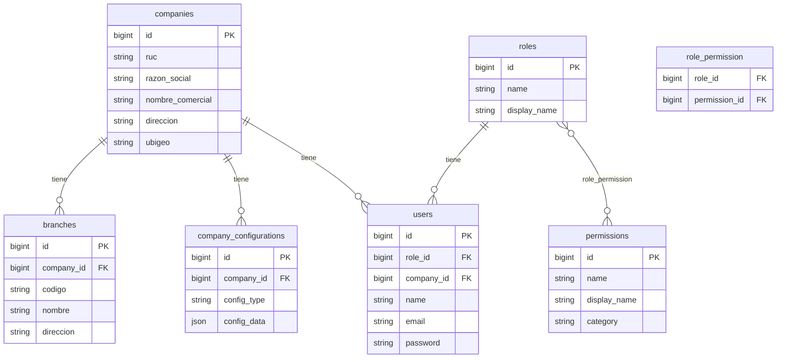
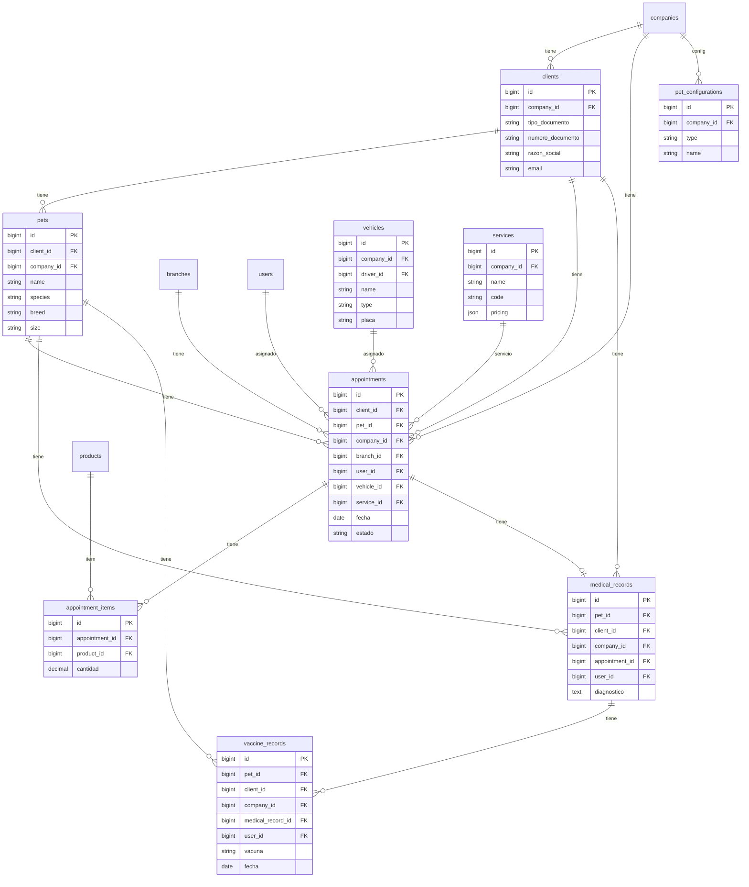
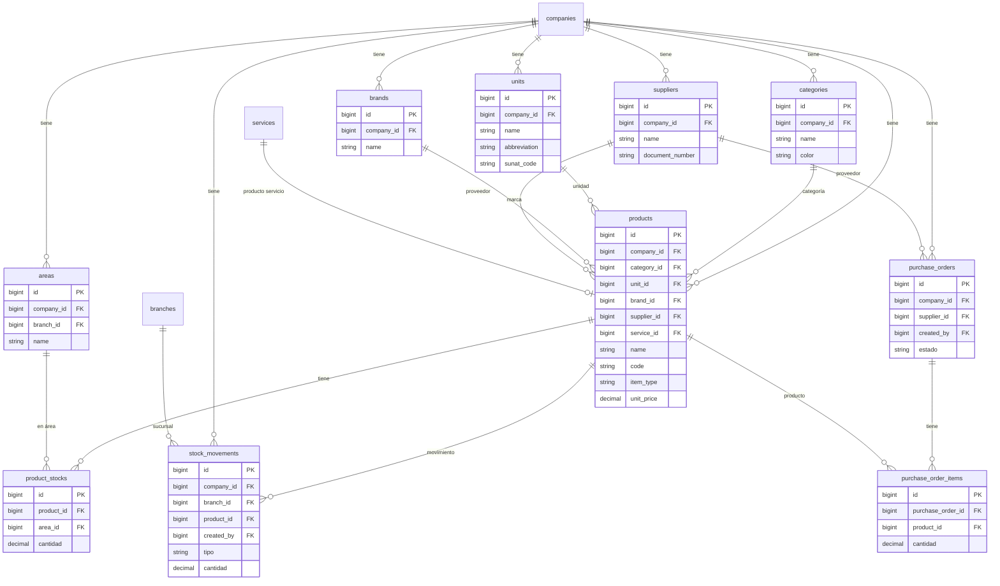
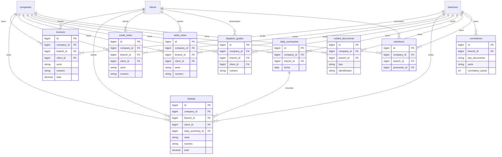
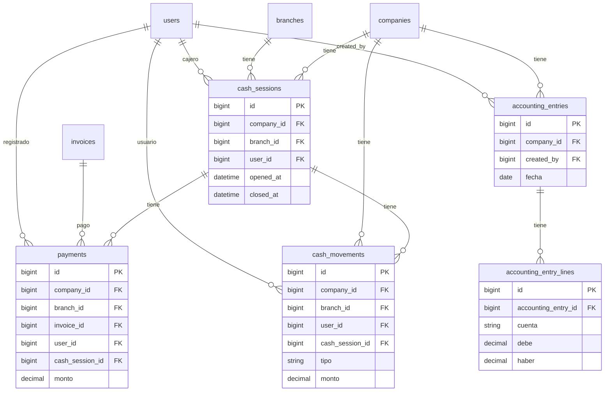
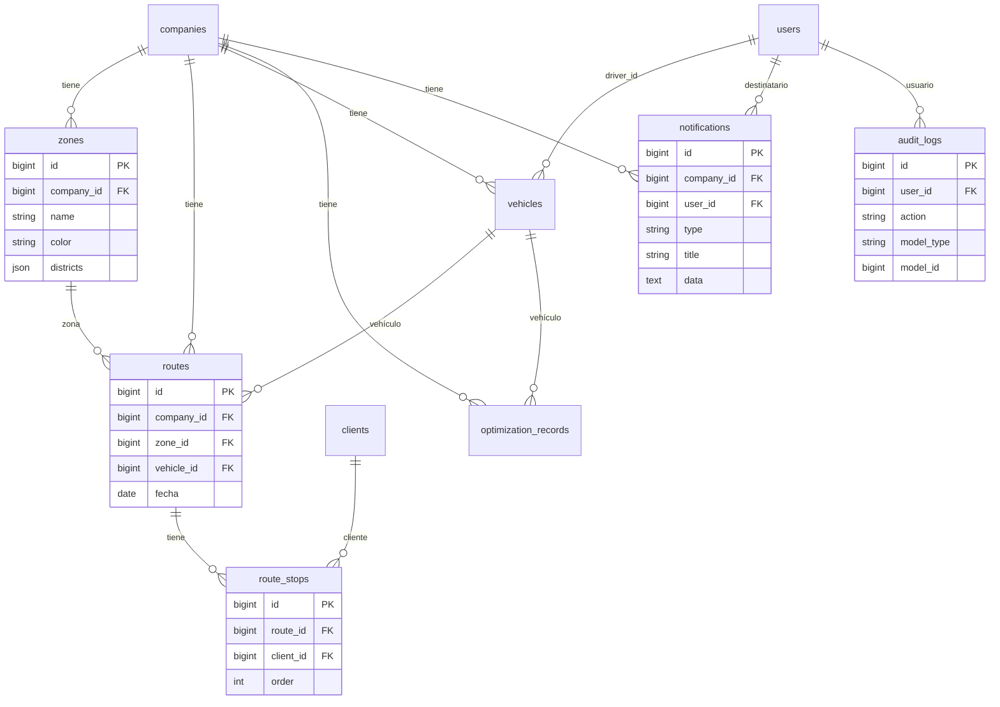
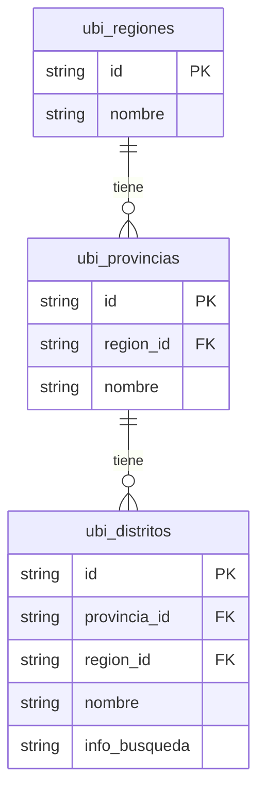

# Base de datos – Diagrama y configuración

## Ubicación de la configuración de conexión

La conexión a la base de datos se define en dos sitios:

| Archivo | Uso |
|--------|-----|
| **`config/database.php`** | Define las conexiones disponibles (mysql, sqlite, etc.) y lee las variables de entorno. La conexión por defecto es `env('DB_CONNECTION', 'sqlite')`. |
| **`.env`** (raíz del proyecto) | Variables reales: `DB_CONNECTION`, `DB_HOST`, `DB_PORT`, `DB_DATABASE`, `DB_USERNAME`, `DB_PASSWORD`. No se versiona; para ver estructura usa **`.env.example`**. |

**Rutas absolutas (backend-grooming):**
- `c:\laragon\www\Proyecto2026\backend-grooming\config\database.php`
- `c:\laragon\www\Proyecto2026\backend-grooming\.env`
- `c:\laragon\www\Proyecto2026\backend-grooming\.env.example`

En `config/database.php`, la conexión **mysql** usa: `DB_HOST`, `DB_PORT`, `DB_DATABASE`, `DB_USERNAME`, `DB_PASSWORD` del `.env`.

---

## Diagramas de tablas y relaciones

Los diagramas están en sintaxis Mermaid. Puedes verlos en:
- GitHub/GitLab (renderizan Mermaid)
- VS Code con extensión "Mermaid"
- [mermaid.live](https://mermaid.live)

---

### 1. Núcleo: Empresa, Sucursal, Usuarios y Roles

---

### 2. Clientes, Mascotas y Citas

---

### 3. Productos, Inventario y Compras

---

### 4. Facturación y Documentos SUNAT

---

### 5. Caja, Pagos y Contabilidad

---

### 6. Rutas, Zonas y Notificaciones

---

### 7. Ubigeo (Perú)

---

## Resumen de tablas por módulo

| Módulo | Tablas principales |
|--------|---------------------|
| **Núcleo** | companies, branches, users, roles, permissions, role_permission, company_configurations |
| **Clientes / Operativo** | clients, pets, appointments, appointment_items, services, vehicles, medical_records, vaccine_records, pet_configurations |
| **Productos / Inventario** | categories, units, areas, brands, suppliers, products, product_stocks, product_sales, stock_movements, purchase_orders, purchase_order_items |
| **Facturación** | invoices, boletas, credit_notes, debit_notes, dispatch_guides, daily_summaries, voided_documents, correlatives, retentions, payments |
| **Caja / Contabilidad** | cash_sessions, cash_movements, payments, accounting_entries, accounting_entry_lines |
| **Rutas / Logística** | zones, routes, route_stops, optimization_records |
| **Sistema** | notifications, audit_logs, personal_access_tokens |
| **Ubigeo** | ubi_regiones, ubi_provincias, ubi_distritos |
